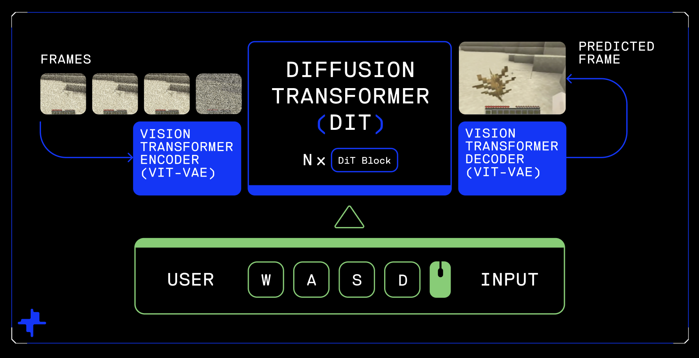
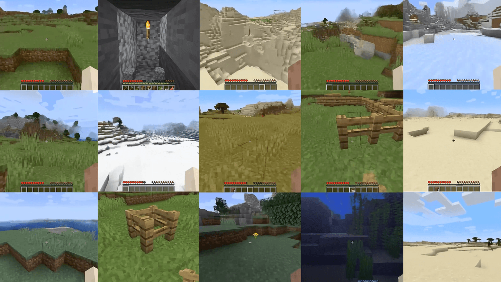
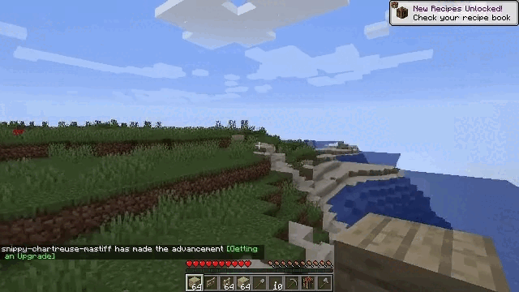
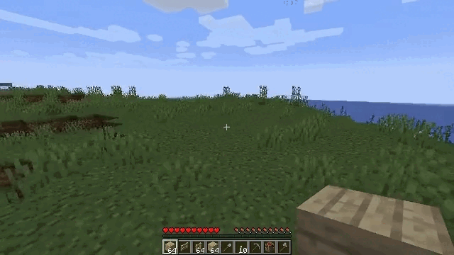

# Oasis 500M





Oasis is an interactive world model developed by [Decart](https://www.decart.ai/) and [Etched](https://www.etched.com/). Based on diffusion transformers, Oasis takes in user keyboard input and generates gameplay in an autoregressive manner. We release the weights for Oasis 500M, a downscaled version of the model, along with inference code for action-conditional frame generation. 

For more details, see our [joint blog post](https://oasis-model.github.io/) to learn more.

And to use the most powerful version of the model, be sure to check out the [live demo](https://oasis.us.decart.ai/) as well!

## Setup
```
git clone https://github.com/etched-ai/open-oasis.git
cd open-oasis
# Install pytorch
pip install torch torchvision --index-url https://download.pytorch.org/whl/cu121
# Install other dependencies
pip install einops diffusers timm av
```

## Download the model weights
Inside the `open-oasis/` directory, run:
```
huggingface-cli login
huggingface-cli download Etched/oasis-500m oasis500m.safetensors # DiT checkpoint
huggingface-cli download Etched/oasis-500m vit-l-20.safetensors  # ViT VAE checkpoint
```

## Basic Usage
We include a basic inference script that loads a prompt frame from a video and generates additional frames conditioned on actions.
```
python generate.py
# Or specify path to checkpoints:
python generate.py --oasis-ckpt <path to oasis500m.safetensors> --vae-ckpt <path to vit-l-20.safetensors>
```
Use a custom image prompt:
```
python generate.py --prompt-path <path to .png, .jpg, or .jpeg>
```
The resulting video will be saved to `video.mp4`. Here's are some examples of a generation from this 500M model!



